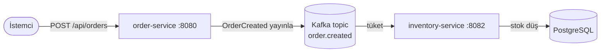

# E-Commerce Event-Driven Microservices

Spring Boot ve Apache Kafka ile kurulmuş, küçük ama gerçek bir event-driven mikroservis sistemi. Bir sipariş oluşturulduğunda `order-service`, Kafka'ya bir `OrderCreated` event'i yayınlar; `inventory-service` bu event'i asenkron olarak tüketip stoğu günceller. İki servis birbirini hiçbir zaman doğrudan çağırmaz.

## Mimari



- **order-service** (port 8080) — REST API sunar, `OrderCreated` event'leri üretir.
- **inventory-service** (port 8082) — event'leri tüketir, PostgreSQL'deki stoğu düşürür.
- **Kafka** — iki servisi birbirinden ayırır; üretici, tüketiciyi beklemez.

## Neden event-driven?

`order-service`, `inventory-service`'i doğrudan REST ile çağırsaydı, stok servisi her çöktüğünde veya yavaşladığında sipariş de başarısız olurdu. Kafka ile `order-service` event'i yayınlayıp işine devam eder. `inventory-service` kapalıysa event Kafka'da bekler ve servis geri açıldığında işlenir — sipariş yine de başarılı olur. Ayrıca yeni tüketiciler (bildirim, analitik vb.) aynı event'e, `order-service`'e dokunmadan abone olabilir.

## Teknolojiler

- Java 21, Spring Boot 4.0
- Spring for Apache Kafka
- Spring Data JPA, PostgreSQL
- Docker / Docker Compose
- Maven

## Yerelde çalıştırma

Altyapıyı başlat (Kafka + PostgreSQL):

```bash
docker compose up -d
```

Her servisi kendi terminalinde çalıştır:

```bash
cd order-service && ./mvnw spring-boot:run
```

```bash
cd inventory-service && ./mvnw spring-boot:run
```

Sipariş oluştur:

```bash
curl -X POST http://localhost:8080/api/orders \
  -H "Content-Type: application/json" \
  -d '{"productSku":"LAPTOP-001","quantity":3}'
```

`inventory-service` logunda stoğun düştüğünü görürsün; değişiklik PostgreSQL'de kalıcı olarak saklanır.

## Bu proje neyi gösteriyor

- Kafka üzerinden asenkron, event-driven iletişim
- Servis başına ayrı veritabanı (database-per-service)
- Servis sınırları arasında JSON serileştirme (sınıf değil, contract paylaşımı)
- JPA kalıcılığıyla katmanlı Spring Boot mimarisi
- Transaction'lı event işleme

## Sonraki adımlar (geliştirilebilir)

- API Gateway + JWT kimlik doğrulama
- Redis cache
- Dead-letter topic ve retry yönetimi
- Birim/entegrasyon testleri (JUnit, Mockito, Testcontainers)
- Servislerin de konteynerlenmesi